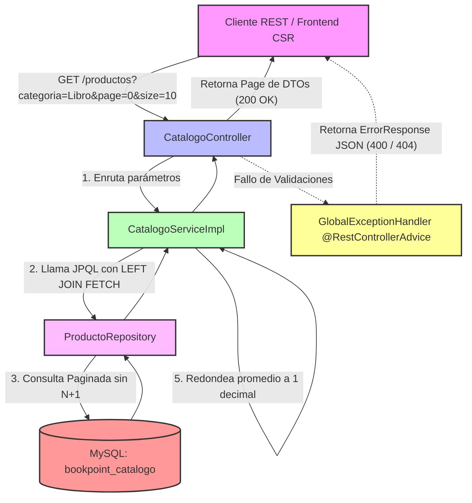

# Microservicio ms-catalogo - BookPoint Chile
> **Área:** Vitrina Pública, Búsqueda Avanzada y Valoración de Clientes  
> **Arquitectura:** Microservicios con Spring Boot (Java 17) bajo Patrón CSR  
> **Puerto por Defecto:** `8084`

---

## 1. Visión General y Responsabilidades

El microservicio **`ms-catalogo`** constituye el punto de entrada de información pública de la plataforma e-commerce de **BookPoint Chile**. Actúa como la "vitrina interactiva" del catálogo comercial de la librería, gestionando y exponiendo la disponibilidad del stock clasificado de libros, artículos de papelería y material educativo.

### Reglas de Negocio Críticas Controladas en la Capa Service:
*   **Búsqueda Dinámica con Paginación:** El servicio soporta filtrado multi-parámetro por autor, editorial, categoría y rangos de precio con paginación nativa automática para evitar la saturación de memoria en el cliente frontend (CSR).
*   **Cálculo Dinámico del Promedio de Calificación:** Las estrellas promedio del producto se recalculan de forma dinámica en la capa de lógica de negocio en cada consulta individual utilizando streams funcionales, evitando el almacenamiento estático redundante en la base de datos.
*   **Restricciones de Calificación Escalar:** El subsistema de opiniones de clientes restringe de manera estricta las calificaciones de las reseñas en un rango escalar de **1 a 5 estrellas**.

---

## 2. Diagrama de Estructura y Procesamiento (Mermaid)

El siguiente flujo detalla el comportamiento del microservicio, destacando la interacción de la paginación con filtros JPQL en el repositorio y la lógica de cálculo dinámico con Streams de Java en el servicio:



---

## 3. Tecnologías Core e Implementación Técnica

*   **Spring Boot 3.2.5:** Framework principal para autogestión de servicios.
*   **Spring Data JPA (Hibernate):** Gestión de persistencia. Mapea la relación `@OneToMany(mappedBy = "producto", cascade = CascadeType.ALL, orphanRemoval = true)` entre `Producto` y `Resena` asegurando que los comentarios eliminados o modificados se sincronicen de manera atómica en la base de datos.
*   **Evitar N+1 mediante JPQL Fetch:** Emplea una consulta avanzada en `ProductoRepository` (`SELECT DISTINCT p FROM Producto p LEFT JOIN FETCH p.resenas ...`) para precargar los productos y sus respectivas reseñas en una sola petición a la base de datos, eliminando el problema de rendimiento N+1.
*   **Streams Funcionales de Java 17:** La lógica de cálculo del promedio aritmético de estrellas en `CatalogoServiceImpl` hace uso extensivo de las APIs funcionales de Java:
    ```java
    double promedio = p.getResenas().stream()
            .mapToInt(Resena::getCalificacion)
            .average()
            .orElse(0.0);
    ```
*   **JSR 380 (Bean Validation 3.0):** Emplea anotaciones en `ResenaRequestDTO` para restringir la entrada de datos del cliente:
    *   `@Min(1)` y `@Max(5)` para asegurar que las calificaciones estén en el rango de estrellas requerido.
    *   `@NotBlank` para evitar inserciones de reseñas vacías.
*   **SLF4J (Logback):** Integración con `@Slf4j` en el `Service` para auditar búsquedas filtradas e incidentes de valoraciones de clientes.

---

## 4. Documentación de Endpoints REST

La API REST del catálogo de BookPoint Chile implementa los siguientes endpoints:

| Método HTTP | Endpoint | Descripción | Códigos HTTP de Respuesta |
| :--- | :--- | :--- | :--- |
| **GET** | `/api/catalogo/productos` | Busca y lista productos de vitrina con filtros dinámicos opcionales (`autor`, `editorial`, `categoria`, rangos de precio) y paginación. | `200 OK` (Éxito) |
| **GET** | `/api/catalogo/productos/{id}`| Recupera el detalle de un libro o artículo y lista sus opiniones y calificación promedio calculada. | `200 OK` (Éxito)<br>`404 Not Found` (ID de producto no existe) |
| **POST** | `/api/catalogo/productos` | Registra una nueva obra o artículo en la vitrina pública del catálogo. | `201 Created` (Éxito)<br>`400 Bad Request` (Datos incompletos) |
| **POST** | `/api/catalogo/productos/{id}/resenas`| Permite a un usuario autenticado dejar un comentario y valoración con estrellas (`@Valid`). | `201 Created` (Éxito)<br>`400 Bad Request` (Calificación fuera de rango)<br>`404 Not Found` (Producto no existe) |

---

## 5. Pruebas de Integración (Postman)

### ✅ Happy Path: Envío Exitoso de Reseña de 5 Estrellas
*   **Método:** `POST`
*   **URL:** `http://localhost:8084/api/catalogo/productos/1/resenas`
*   **Body (JSON Raw):**
```json
{
  "usuarioId": 10,
  "usuarioNombre": "Renato Duoc",
  "calificacion": 5,
  "comentario": "Excelente libro. Los diagramas estructurales de patrones en Java son sumamente didácticos."
}
```
*   **Efecto:** El sistema localizará el producto con ID `1`. Añadirá la reseña y recalculará dinámicamente la calificación media del artículo, retornando un código **201 Created** y persistiendo los datos de la opinión del cliente en la tabla `resenas`.

---

### ❌ Flujo de Error: Intento de Envío de Reseña Fuera de Rango (8 Estrellas)
*   **Método:** `POST`
*   **URL:** `http://localhost:8084/api/catalogo/productos/1/resenas`
*   **Body (JSON Raw):**
```json
{
  "usuarioId": 10,
  "usuarioNombre": "Renato Duoc",
  "calificacion": 8,
  "comentario": "Este libro está fuera de serie, le doy 8 estrellas."
}
```
*   **Efecto:** Las anotaciones de JSR 380 interceptan la petición a nivel de controlador por violar el límite `@Max(5)`. El `@RestControllerAdvice` (`GlobalExceptionHandler`) responde con **HTTP 400 Bad Request** y el siguiente JSON estructurado:

```json
{
  "timestamp": "2026-05-24T17:50:10.987654",
  "status": 400,
  "error": "Validation Failed",
  "message": "Input validation errors occurred.",
  "path": "/api/catalogo/productos/1/resenas",
  "details": [
    "La calificación máxima es 5 estrellas"
  ]
}
```

---

## 6. Instrucciones de Ejecución

### Requisitos Previos:
1.  **Java JDK 17** configurado localmente.
2.  **Apache Maven 3.8+** instalado.
3.  **MySQL Server** en ejecución.

### Configuración del Entorno:
1.  Crea la base de datos `bookpoint_catalogo` en tu MySQL local:
    ```sql
    CREATE DATABASE bookpoint_catalogo;
    ```
2.  Configura las credenciales en el archivo [application.properties](src/main/resources/application.properties):
    ```properties
    spring.datasource.url=jdbc:mysql://localhost:3306/bookpoint_catalogo?createDatabaseIfNotExist=true&useSSL=false&serverTimezone=UTC
    spring.datasource.username=root
    spring.datasource.password=tu_contraseña
    ```

### Sembrado Automático de Datos de Prueba (Boot Seeder):
El microservicio incorpora un sembrador inteligente `DataInitializer.java` que se ejecuta al iniciar la aplicación. Si detecta la base de datos vacía, insertará de forma automática:
*   Cinco productos base en vitrina (libros de algoritmos y patrones en Java, destacadores Stabilo y kits educativos Arduino).
*   Cinco reseñas iniciales asociadas de prueba, permitiendo comprobar de manera instantánea el cálculo matemático de los promedios de estrellas desde Postman.

### Ejecutar el Microservicio:
Abre una terminal en la raíz de `ms-catalogo` y ejecuta el comando de arranque:

```bash
mvn clean spring-boot:run
```

El servicio iniciará en el puerto **`8084`**, exponiendo las búsquedas y el catálogo al frontend de la aplicación.
